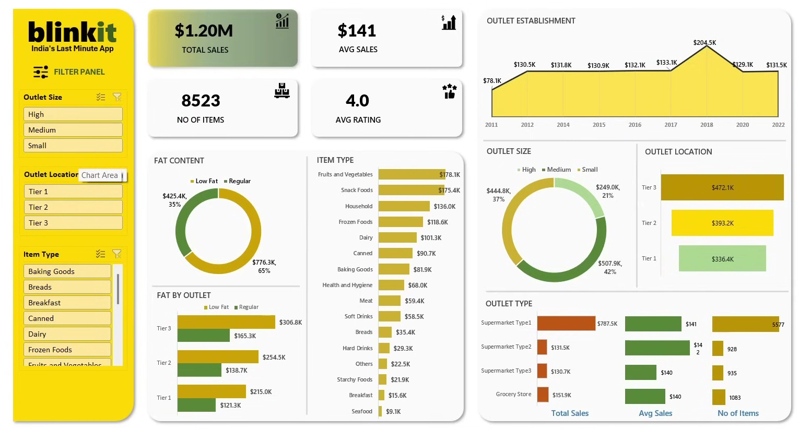

# Blinkit Sales Analysis Dashboard | Power BI

An interactive Power BI dashboard designed to analyze Blinkit's sales performance, customer ratings, product categories, and outlet-level performance. The dashboard provides actionable insights through dynamic KPIs, visualizations, and interactive filters.

## 📊 Dashboard Preview



## 🎯 Project Objective

The objective of this project is to analyze Blinkit's sales data and build an interactive business intelligence dashboard that helps identify:

- Overall sales performance
- Sales distribution across different item types
- Outlet performance by size and location
- Customer rating trends
- Fat content contribution to sales
- Outlet establishment trends
- Product and outlet-level performance

## 🛠️ Tools & Technologies

- **Power BI** – Dashboard development and data visualization
- **Power Query** – Data cleaning and transformation
- **DAX** – KPI calculations and measures
- **Excel/CSV** – Data source

## 📌 Key KPIs

The dashboard tracks the following major performance indicators:

| KPI | Value |
|---|---:|
| Total Sales | $1.20M |
| Average Sales | $141 |
| Number of Items | 8,523 |
| Average Rating | 4.0 |

## 📈 Dashboard Features

### 1. Sales Performance
- Total Sales and Average Sales KPIs
- Sales trends based on outlet establishment year
- Sales comparison across different outlet types

### 2. Product Analysis
- Sales by Item Type
- Comparison of Low Fat vs Regular products
- Item-level contribution to overall sales

### 3. Outlet Analysis
- Sales by Outlet Size
- Sales by Outlet Location
- Performance comparison across Tier 1, Tier 2, and Tier 3 locations
- Outlet type performance analysis

### 4. Interactive Filtering

The dashboard includes interactive slicers for:

- Outlet Size
- Outlet Location
- Item Type
- Fat Content

These filters allow users to dynamically drill down into specific segments of the dataset.

## 🔍 Key Insights

Some of the insights identified from the analysis include:

- Total sales across the analyzed dataset are approximately **$1.20M**.
- **Low Fat products contribute around 65%** of total sales, while Regular products contribute approximately 35%.
- **Tier 3 outlets generate the highest sales**, followed by Tier 2 and Tier 1 outlets.
- Fruits and Vegetables and Snack Foods are among the **highest-performing item categories**.
- Outlet establishment year analysis shows variation in sales performance across different years.
- Supermarket Type1 contributes the largest share of sales among outlet types.

## 📂 Project Structure

```text
Blinkit-Sales-Analysis/
│
├── Blinkit_Sales_Data.csv
├── dashboard.png
└── README.md
